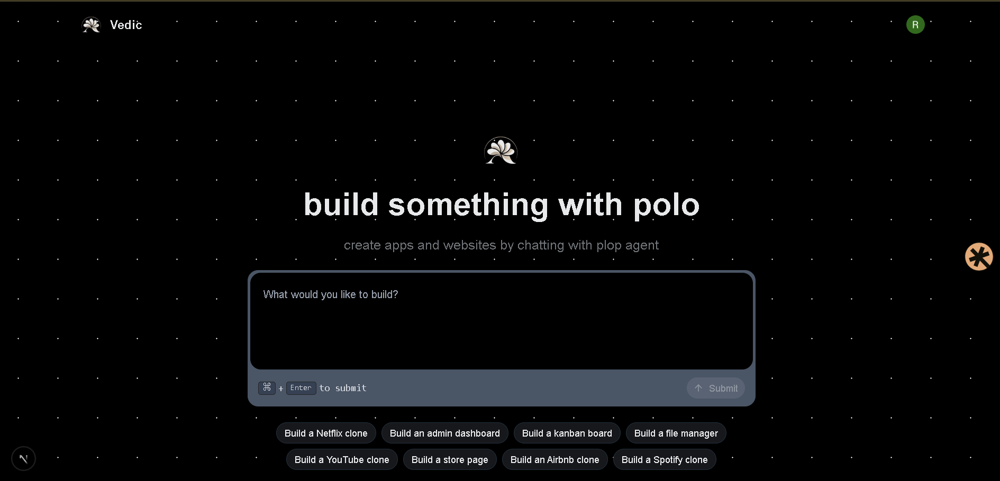

# Vibe (Vedic) - AI Vibe Coding Platform

Build full-stack web apps from chat prompts using a multi-agent coding pipeline, sandbox execution, and live preview fragments.



## What This Project Does

- Provides a chat UI where users describe an app/feature.
- Sends prompts to an autonomous coding pipeline powered by Inngest + `@inngest/agent-kit`.
- Generates/updates project files inside an E2B sandbox.
- Stores chat messages, generated fragments, and metadata in PostgreSQL via Prisma.
- Shows progress/status updates and final preview URL in the project chat view.

## Tech Stack

- `Next.js` 15 (App Router) + TypeScript
- `tRPC` for API procedures
- `Prisma` + PostgreSQL
- `Clerk` for auth
- `Inngest` for async background workflow orchestration
- `@inngest/agent-kit` for coding agents/tools
- `E2B Code Interpreter` for sandboxed file/command execution
- `Tailwind CSS` + `shadcn/ui` for UI

## Prerequisites

- Node.js 20+ (recommended)
- npm 10+
- PostgreSQL database
- Clerk project keys
- OpenAI API key
- E2B API key

## 1) Clone and Install

```bash
git clone <your-repo-url>
cd vibe
npm install
```

## 2) Environment Variables

Create `.env` in the repo root:

```bash
DATABASE_URL="postgresql://<user>:<pass>@<host>/<db>?sslmode=require"

NEXT_PUBLIC_APP_URL="http://localhost:3000"

OPENAI_API_KEY="sk-..."
OPENAI_MODEL="gpt-5.4-mini"

E2B_API_KEY="e2b_..."

NEXT_PUBLIC_CLERK_PUBLISHABLE_KEY="pk_..."
CLERK_SECRET_KEY="sk_..."
NEXT_PUBLIC_CLERK_SIGN_IN_URL="/sign-in"
NEXT_PUBLIC_CLERK_SIGN_IN_FALLBACK_REDIRECT_URL="/"
NEXT_PUBLIC_CLERK_SIGN_UP_URL="/sign-up"
NEXT_PUBLIC_CLERK_SIGN_UP_FALLBACK_REDIRECT_URL="/"
```

Notes:
- `OPENAI_MODEL` is validated in runtime. Current allowed values are defined in `src/inngest/functions.ts`.
- Keep all secrets private. Do not commit `.env`.

## 3) Database Setup (Prisma)

Generate Prisma client and sync schema:

```bash
npx prisma generate
npx prisma db push
```

If you prefer migrations:

```bash
npx prisma migrate dev
```

## 4) Run the App

Start Next.js:

```bash
npm run dev
```

App should be available at `http://localhost:3000`.

## 5) Run Inngest Dev Server (Required for Agent Jobs)

In a second terminal, run:

```bash
npx inngest-cli@latest dev -u http://localhost:3000/api/inngest
```

Why this is required:
- Chat requests enqueue the `code-agent/run` event.
- Inngest dev server receives and executes the background function.

## Available Scripts

- `npm run dev` - start local dev server
- `npm run build` - production build
- `npm run start` - run production build
- `npm run lint` - run Next.js lint

## Core Architecture

### High-level request flow

1. User submits prompt in project chat.
2. `messages.create` tRPC mutation stores user message and emits `code-agent/run`.
3. Inngest function (`src/inngest/functions.ts`) executes multi-agent workflow.
4. Coding agent writes files/runs commands in E2B sandbox.
5. Function stores assistant result message + `Fragment` (preview URL + files JSON).
6. Frontend polls messages and renders status/result.

## Main Coding Agent Technical Design

Primary implementation lives in `src/inngest/functions.ts`.

### Agents

- `planning-agent`: produces structured execution plan (`<execution_plan>`)
- `code-agent`: performs actual implementation with tools
- `review-agent`: quality gate (`<review>`, `<needs_changes>`)
- `fragment-title-generator`: creates short preview title
- `response-generator`: writes user-facing final assistant response

### Tooling inside `code-agent`

- `terminal`: executes shell commands in sandbox
- `createOrUpdateFiles`: writes/updates files and syncs in-memory file state
- `readFiles`: reads files from sandbox for context

### State model

The network state tracks:
- `summary`
- `plan`
- `review`
- `needsChanges`
- `reviewLoops`
- `files` (path-to-content map)

### Router and refinement loop

The network routes:
- Plan -> Build -> Review
- If reviewer requests changes, it loops build/review up to `MAX_REVIEW_LOOPS`
- For complex prompts, it enforces stronger multi-file output thresholds

### Sandbox behavior

- Sandbox created via E2B.
- On reconnect/new sandbox fallback, previous generated files are restored.
- Final preview URL comes from sandbox host (port `3000`).

### Output persistence

On completion:
- Assistant `Message` is created (`RESULT` or `ERROR`)
- `Fragment` is created with:
  - `sandboxUrl`
  - `title`
  - `files` JSON payload

## Database Models (Prisma)

Defined in `prisma/schema.prisma`:

- `Project`
- `Message` (`USER` / `ASSISTANT`, `RESULT` / `ERROR`)
- `Fragment` (linked 1:1 with message)
- `Usage` (credit/rate usage bookkeeping)

## Key Source Paths

- Inngest route: `src/app/api/inngest/route.ts`
- Agent workflow: `src/inngest/functions.ts`
- Agent prompts: `src/prompt.ts`
- Message procedures: `src/modules/messages/server/procedures.ts`
- Prisma schema: `prisma/schema.prisma`

## Troubleshooting

- Agent jobs not running:
  - Ensure Inngest dev server is running with the correct callback URL.
- "OPENAI is not set in environment variables":
  - Verify `OPENAI_API_KEY` in `.env`.
- Unsupported model error:
  - Use an allowed model string (see `ALLOWED_OPENAI_MODELS` in `src/inngest/functions.ts`).
- No preview or fragment:
  - Check `E2B_API_KEY`, sandbox availability, and database connectivity.
- Prisma errors:
  - Re-run `npx prisma generate` and `npx prisma db push`.

## Production Notes

- Set all env variables in your deployment provider.
- Run database migrations as part of deploy.
- Run Inngest in production mode (cloud or self-hosted worker setup).
- Never expose server secrets to client-side env variables.